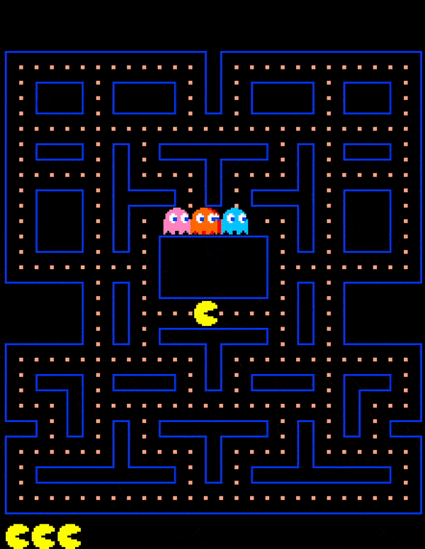

## OOP Java Game (2020)



### Description
Prototype of Pac-Man game using Java and Object-oriented Programming

### Requirements
[Java 8](https://www.oracle.com/au/java/technologies/javase/javase-jdk8-downloads.html)

[Gradle](https://gradle.org/install/)

### Usage
```bash
gradle run
```